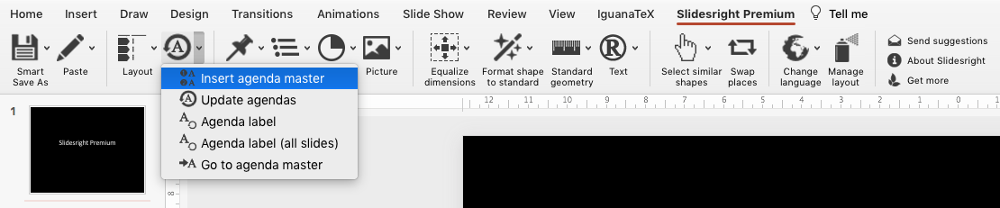
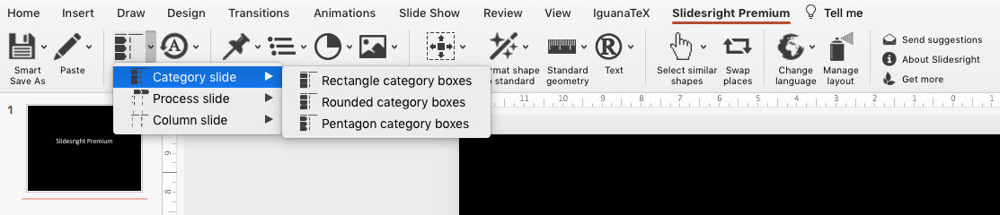
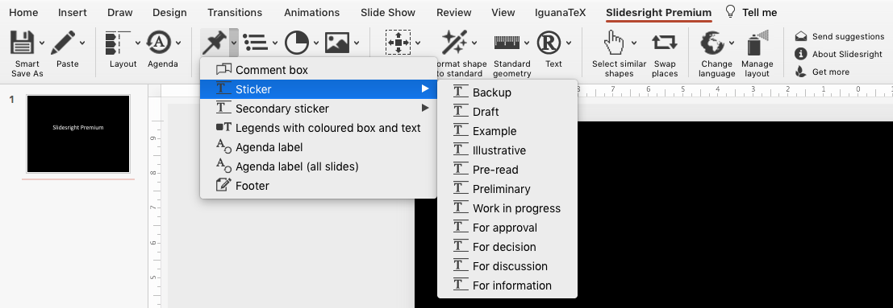
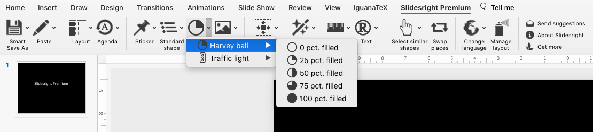
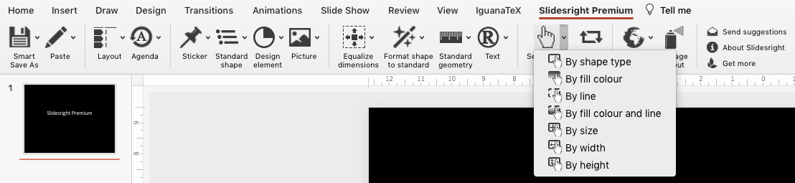
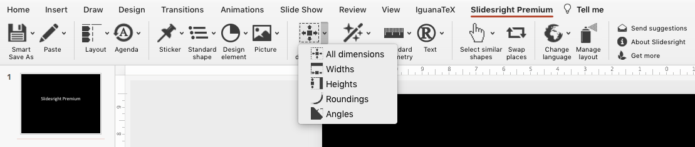

# Slidesright PowerPoint add-in for efficiently making management consultant style presentations :rocket:

Use best-practice methods from management consulting to structure presentations and communicate your message clearly.

### Organize presentations and hand-outs with dynamic tables of content / multiple agenda slides

### Structure your slides better with best-practice layouts, organize your content with structure elements

### Clearly communicate intent, desired outcome or just general CYA with slide stickers

### Visually communicate progress and status in a way that is easy-to-understand for all audiences

### Work smarter with elements by quickly selecting similar shapes

### Make your custom shapes similar by effortlessly reshaping or formatting them to your standards 

This is a project from 2013-2014. Let me know if there's interest in having an update for 2020+ :dizzy:
